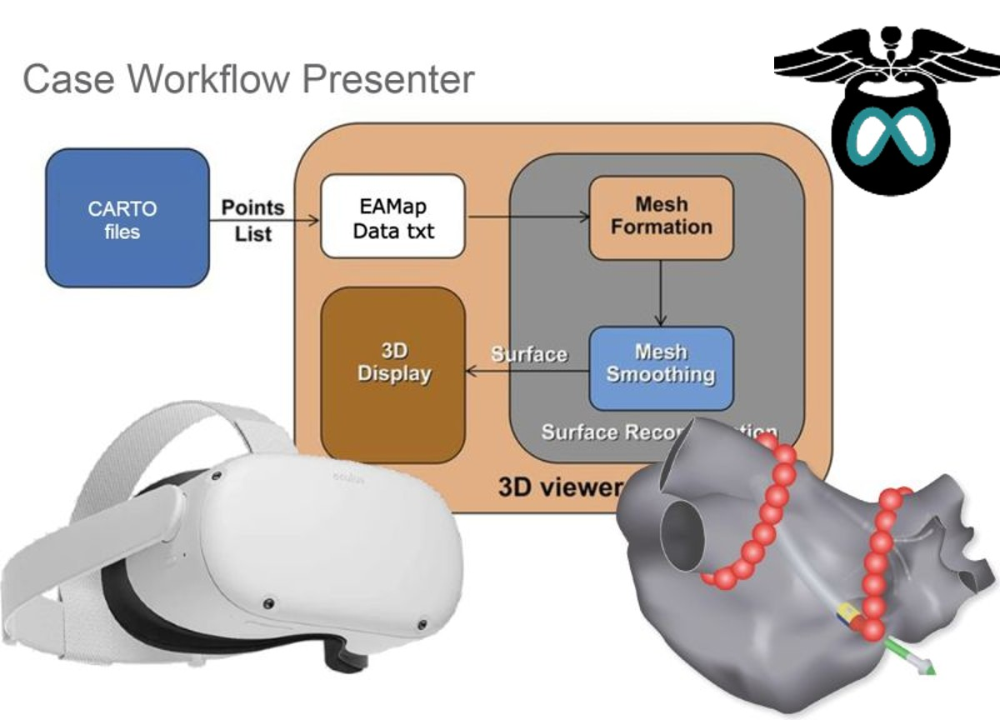
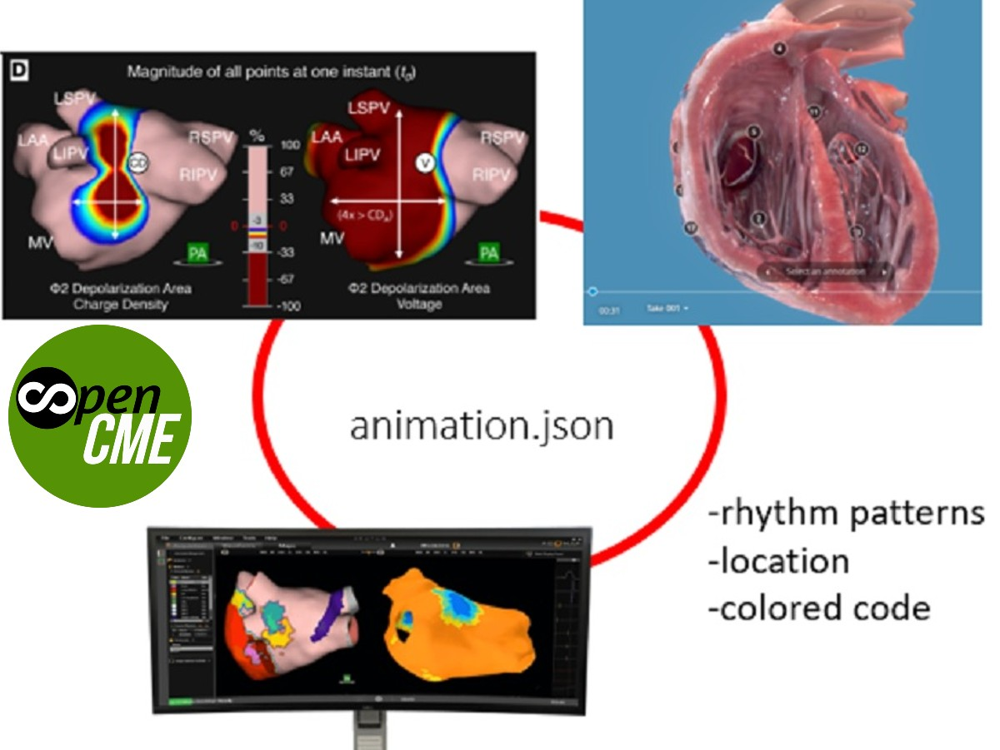
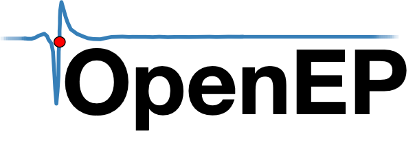
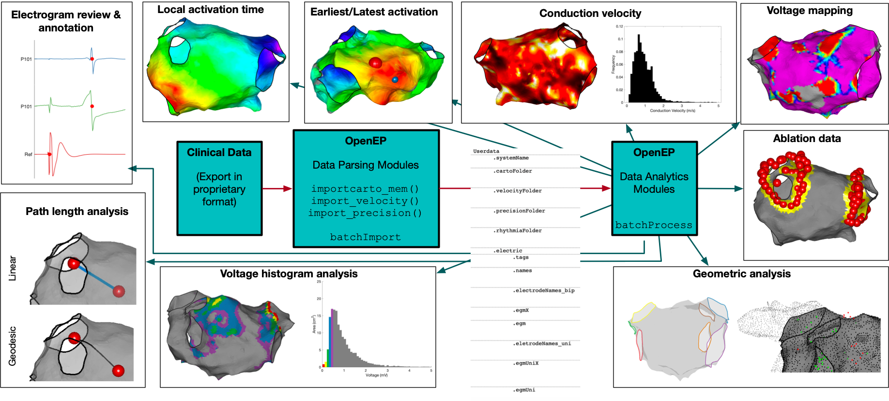
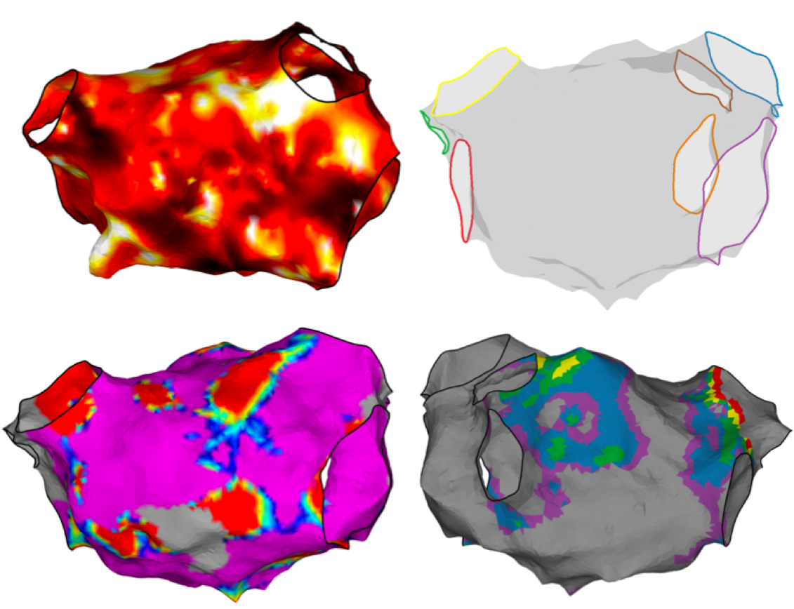
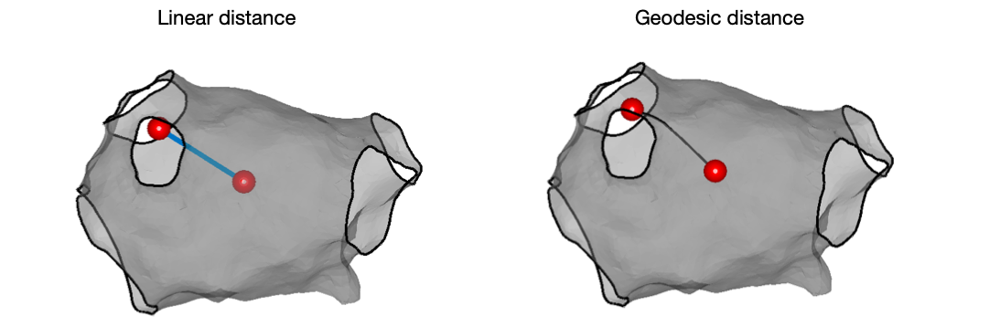

# EP Case Presenter
<h3 align="center">
	Open-CME Platform for Medical Education.
</h3>
<h1 align="center">
	
</h1>

	<strong>
		<a href="https://www.linkedin.com/in/hsienchen/">Website</a>
	</strong>

# Open CME-the Project
Open CME is a open-source project, it meants to build a VR-powered ** peer-to-peer communiation platform**. 

We made the project with the intent that it can help bridge to communication hurdles and facilitate smooth and seamingless communications among medical professionals.

Contact us for further information at <a href="https://https://simonche.github.io/">Open CME</a>.

# Hardware

  

# 3D Case Presenter

  

# Install OPENEP environment

This repository contains the website for the OpenEP project.

  

# Develop Locally
1. Install a full [Ruby development environment](https://jekyllrb.com/docs/installation/)

1. Install Jekyll and Bundler:

        gem install jekyll bundler

1. Install dependencies from Gemfile:

        bundle install

1. Build the site and start the Jekyll local development server

        bundle exec jekyll serve --livereload

1. Open [http://localhost:4000](http://localhost:4000) in the browser

1. 🎉

# Editing Content

Functions to assist in the reading, analysis and plotting of ECG and VCG data

  

# Live Case Discussion

  

  

